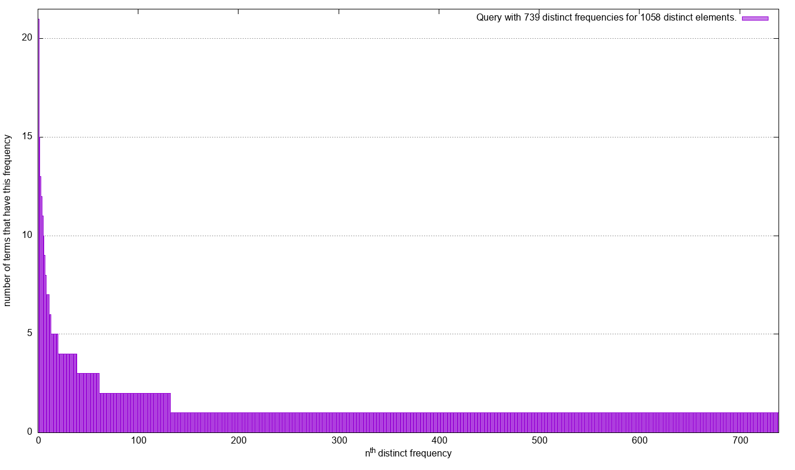

## frequencies of frequencies

The query that processes the frequencies of frequencies for `?s ?p ?o`
focusing on one distinct variable at a time. For distinct `?s`, it
computes the following:

```
SELECT (COUNT(*) AS ?f) ?c WHERE {
    SELECT (COUNT(*) AS ?c) ?s WHERE {?s ?p ?o} GROUP BY ?s
} GROUP BY ?c
```

To ease the process, we provide an executable to run such a query on
a Blazegraph datastore:

```bash
# do not forget to -Xmx60g or more to increase memory of JVM
java -jar fof-jar-with-frequencies.jar \
    --database=path/to/dataset.jnl \
    --query="?s ?p ?o" \
    --variable="?s"
```


You can find the results of this command in the [results
directory](./results). For plotting the results using gnuplot:

```
gnuplot -e "set output 'images/watdiv_fof_spo_s.png'" -e "datafile='results/watdiv_fof_spo_o.csv'" \
    frequencies_of_frequencies.plot
```

On the 3 datasets for each variable `?s`, then `?p`, then `?o`, we
obtain the following: <i>from left to right we have the datasets
`WatDiv10M`, `DBPedia`, and `WDBench`; from top to bottom we have `?s`,
`?p`, and `?o`.</i>

<p align="left">
  
  &nbsp; &nbsp;
  
</p>

<p align="left">
  
  &nbsp; &nbsp;
  
  &nbsp; &nbsp;
  
</p>

<p align="left">
  
  &nbsp; &nbsp;
  
</p>

Plots are missing for WDBench as they are too demanding of
resources. Even with 64G of RAM, Blazegraph fails to provide results
for these frequencies of frequencies queries.
